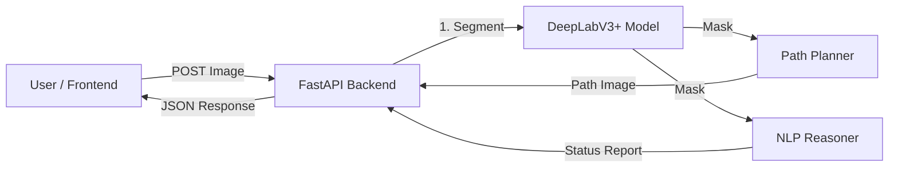

# Duality AI TechnoMania 2.0 - Project Architecture

## 1. Project Overview
**Duality AI TechnoMania 2.0** is an end-to-end off-road UGV (Unmanned Ground Vehicle) autonomy system. It combines deep learning-based semantic segmentation, cost-aware path planning, and rule-based NLP reasoning to navigate complex unstructured environments (e.g., deserts, rocky terrains).

The system identifies safe traversable corridors, detects hazards (rocks, logs, vegetation), and generates optimal paths while providing real-time situational awareness reports.

---

## 2. High-Level Architecture
The project follows a **Client-Server** architecture:

*   **Frontend**: A web-based User Interface (UI) that allows users to upload images and visualize results (Segmentation Overlay, Path Planning, NLP Report).
*   **Backend**: A **FastAPI** Python server that hosts the AI models and logic. It exposes REST API endpoints to process images and return JSON responses containing Base64-encoded visualizations and textual data.

---

## 3. Backend Architecture
The backend is built using **FastAPI** and is organized into modular components.

### 3.1. Core Components
| Component | File | Description |
| :--- | :--- | :--- |
| **API Server** | `backend/app.py` | Entry point. Handles HTTP requests, image decoding, and response formatting. |
| **Segmentation** | `backend/segmentation/` | Contains the DeepLabV3+ model definition and training logic. |
| **Path Planner** | `backend/path_planner.py` | Implements cost-aware path finding (Dijkstra + Distance Transform). |
| **NLP Reasoner** | `backend/nlp_reasoner.py` | Analyzes scene content to generate situational reports (READY/CAUTION/BLOCKED). |

### 3.2. Segmentation Model (`segmentation/model.py`)
*   **Architecture**: **DeepLabV3+**
*   **Encoder**: **ResNet34** (pre-trained on ImageNet)
*   **Input**: RGB Images (resized/padded to be divisible by 32).
*   **Output**: Pixel-wise classification mask (8 classes).
*   **Classes**:
    1.  Sky (0)
    2.  Landscape (1) - *Traversable*
    3.  Dry Grass (2) - *Traversable*
    4.  Ground Clutter (3) - *Rough*
    5.  Rocks (4) - *Hard Obstacle*
    6.  Logs (5) - *Hard Obstacle*
    7.  Bushes (6) - *Soft Obstacle*
    8.  Trees (7) - *Soft Obstacle*

### 3.3. Path Planner (`path_planner.py`)
A custom **Cost-Aware Planner** designed for UGVs:
1.  **Cost Map Generation**: Converts the segmentation mask into a traversal cost map.
    *   *Hard Obstacles* (Rocks, Logs) = Infinite Cost.
    *   *Soft Obstacles* (Bushes) = High Cost.
    *   *Traversable* (Landscape) = Low Cost.
2.  **Distance Transform**: Computes a "Clearance Map" to identify wide corridors.
    *   Adds a potential field (`20.0 / distance`) to push the path toward the center of wide spaces.
3.  **Seed Selection**: Automatically finds the widest "gate" at the bottom of the image to start the path.
4.  **Path Finding**: Uses **Dijkstra's Algorithm** to find the optimal path to the furthest reachable point in the scene.
5.  **Scoring**: Evaluates candidate paths based on:
    *   *Primary*: Maximize Corridor Width.
    *   *Secondary*: Maximize Reachable Length.
    *   *Tertiary*: Minimize Curvature (Jerk).

### 3.4. NLP Reasoner (`nlp_reasoner.py`)
A rule-based logic engine that assesses mission safety:
*   Calculates the percentage of pixels belonging to hazard classes (Rocks, Logs, Bushes, Trees).
*   **Logic**:
    *   **READY**: < 15% Hazard Density.
    *   **CAUTION**: 15% - 50% Hazard Density.
    *   **BLOCKED**: > 50% Hazard Density.

---

## 4. Connection & Data Flow
The Frontend and Backend communicate via **REST API** over HTTP.

### 4.1. API Endpoints
1.  **`POST /predict`**
    *   **Input**: Image File (Multipart/Form-Data).
    *   **Process**: Runs segmentation inference.
    *   **Output**: JSON `{ "overlay_image": "<Base64>", "metrics": {...} }`
2.  **`POST /path`**
    *   **Input**: Image File.
    *   **Process**: Runs segmentation -> Generates Cost Map -> Plans Path -> Draws Path.
    *   **Output**: JSON `{ "path_image": "<Base64>" }`
3.  **`POST /report`**
    *   **Input**: Image File.
    *   **Process**: Runs segmentation -> Calculates Hazard Density -> Determines Status.
    *   **Output**: JSON `{ "status": "READY", "summary": "..." }`

### 4.2. Image Handling
*   Images are sent as standard file uploads.
*   Responses return images as **Base64-encoded Strings**. This allows the frontend to display them directly (``) without needing secondary file storage or URL handling.

---

## 5. Model Performance & Metrics
The model is evaluated using **IoU (Intersection over Union)**, a standard metric for semantic segmentation.

### 5.1. Accuracy (mIoU)
*   **Mean IoU (mIoU)**: **~61.4%** (Average across all classes)
*   **Per-Class Performance**:
    *   **Sky**: 93.4% (Excellent)
    *   **Trees**: 84.6% (Very Good)
    *   **Landscape**: 66.2% (Good)
    *   **Bushes**: 66.7% (Good)
    *   **Logs/Rocks**: ~35-43% (Challenging due to texture similarity with ground)

### 5.2. Training Details
*   **Loss Function**: Combined **CrossEntropyLoss + DiceLoss** (Handles class imbalance).
*   **Optimizer**: **AdamW** (Learning Rate: 3e-4).
*   **Validation**: Performed after every epoch; best model saved based on mIoU.

---

## 6. Process Life Cycle
A complete request lifecycle looks like this:

1.  **Request**: User uploads an image via the Web UI.
2.  **Ingestion**: `app.py` receives the file stream and converts it to a NumPy array (RGB).
3.  **Preprocessing**:
    *   Image is padded to ensure height/width are divisible by 32 (required by DeepLabV3+).
    *   Normalized using ImageNet mean/std.
4.  **Inference**:
    *   Model predicts logits -> `argmax` -> **Segmentation Mask** (H, W).
5.  **Task Execution** (Depending on Endpoint):
    *   *Overlay*: Mask is colorized and blended with the original image.
    *   *Path*: Mask is converted to a cost map; Dijkstra finds the safest corridor; Path is drawn on the image.
    *   *Report*: Mask pixels are counted; status is derived from hazard density.
6.  **Encoding**: Resulting images are encoded to PNG -> Base64.
7.  **Response**: JSON payload is sent back to the UI.
8.  **Rendering**: UI decodes Base64 and updates the display.
